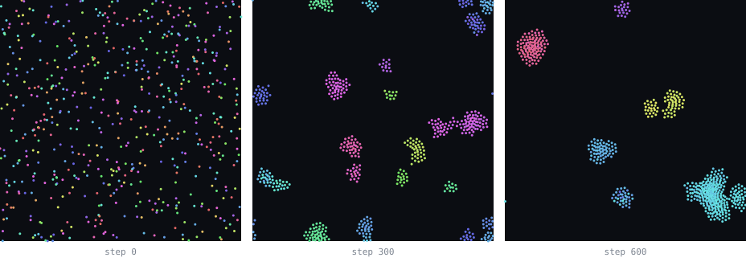

# distributed_swarm

A distributed implementation of Reynolds' boids model, built to measure what
spatial decomposition actually costs and when it stops paying off.

Boids is decentralized by construction: every agent steers using only the
neighbours inside its perception radius `r`. That makes it look trivially
parallel, but in practice it isn't. Moving the simulation from one machine to a cluster introduces communication, synchronization, and load-imbalance costs that don't exist sequentially, and flocking makes the last one worse over time because agents cluster, so a uniform spatial partition drifts steadily out of balance.

This repository contains the implementation and the measurement harness for a
bachelor thesis on that question.


250 agents over 600 steps, looping. Colour is direction, so a flock shows up as
a patch of one colour: they start scattered and heading everywhere, then clump
into groups that move together. Agents crossing an edge reappear on the other
side — the world wraps around.



The same thing as still frames, with 600 agents.

## Research questions

1. **Fidelity** - does the distributed simulation reproduce the same emergent
   behaviour as the sequential one?
2. **Scaling** - how do runtime and throughput respond to added nodes, both at
   fixed total swarm size (strong scaling) and at fixed per-node load (weak
   scaling)?
3. **Crossover** — at what point do communication and synchronization dominate
   the useful work?
4. **Balance** — how much does flock-induced clustering degrade load balance
   across nodes, and how much barrier wait time does that cost?

## Approach

| Concern | Choice |
| --- | --- |
| Neighbour search | Uniform grid / cell lists, cell edge ≥ `r` (O(n) average, not naive O(n²)) |
| Partitioning | Data decomposition over the same uniform grid |
| Boundary handling | Ghost-cell exchange, ghost width ≥ `r` |
| Ownership transfer | Agent migration on region crossing |
| Coordination | Bulk Synchronous Parallel — one superstep per simulation step |

The sequential baseline uses the *same* uniform grid as the distributed
version. Comparing against a naive O(n²) implementation would report
algorithmic speedup as if it were distribution speedup.

Model parameters (`r`, steering weights `w_s`/`w_a`/`w_c`, `v_max`, `Δt`) are
fixed rather than tuned, so that only the execution architecture varies between
runs.

## Status

The simulation is finished and correct. Splitting it across processes produces
bit-identical results to running it on one — verified at 1, 2, 3, 4, 8, 10 and
20 processes. What remains is measuring it.

- [x] Toolchain verified — processes start, exchange with neighbours, synchronise
- [x] Core model types — vectors, agents, parameters, toroidal geometry
- [x] Sequential baseline — steering rules, uniform grid, deterministic setup
- [x] Visualisation — record a run to CSV, draw it as a page or an SVG
- [x] Splitting the world — vertical strips, one per process
- [x] Border sharing — copies of edge agents swapped between neighbours
- [x] Handing agents over when they cross a boundary
- [x] Fidelity comparison against the baseline
- [ ] Benchmark harness
- [ ] Scaling measurements

### The distributed run is identical to the sequential one

Both runners end by printing one number summarising the exact final state of
every agent — position and velocity, bit for bit. They match:

```
sequential:    475a1e244ee75967
 1 process:    475a1e244ee75967
 2 processes:  475a1e244ee75967
 4 processes:  475a1e244ee75967
 8 processes:  475a1e244ee75967
```

Not "close" and not "statistically similar" — the same simulation, however many
processes run it.

This is checked in two separate ways, because they catch different mistakes. A
test runs the whole scheme — split, swap borders, step, hand over, repeat — for
200 steps inside a single process and compares against the sequential result, so
algorithm errors show up under plain `cargo test`. The fingerprint then catches
errors in the message passing itself, which that test cannot see.

Three pieces make it work:

- **Strips.** The world is cut into vertical slices, one per process. Nobody is
  in charge: each process works out its own slice from its number, and they
  agree because they all do the same sum.
- **Border copies.** Before each step, every process sends its neighbours a copy
  of the agents along its edges, as wide as an agent can see. Those copies are
  read-only and thrown away after the step.
- **Hand-overs.** After each step, an agent that has walked into a neighbour's
  strip becomes theirs.

The order matters: copies are made before the step, hand-overs happen after. An
agent is therefore never both copied and handed over in the same step, which
would leave two processes each believing they owned it.

### Load imbalance is already visible

Flocks bunch up, and a fixed grid of strips cannot follow them. At 8 processes
with 2000 agents:

```
  step   agents per process (min / average / max)
   200     129 /   250.0 /   400   busiest 1.60x average
   600     132 /   250.0 /   587   busiest 2.35x average
```

One process ends up with four times another's work, and every step the rest wait
at the barrier for it. Measuring that cost is what comes next.

The uniform grid is checked against the every-agent-against-every-agent search:
both must produce bit-identical results, step after step. The slow version stays
in the codebase as that checker and is never what speed is measured against —
comparing to it would report replacing a bad algorithm as if it were a gain from
spreading the work out.

## Repository layout

A Cargo workspace of three crates. `core` holds everything both runners share
and knows nothing about MPI — that is what lets the two executions run identical
model code, so any difference in their results comes from the distribution
itself.

```
Cargo.toml       workspace
crates/core/     the model — one file per idea:
                   vector2d, agent, params, constants   the pieces
                   geometry                             wrap-around distances
                   neighbours                           the slow, obvious search
                   grid                                 the fast search
                   steering, simulation                 the three rules, one step
                   partition, borders, migration        who owns which strip,
                                                        what is copied across it,
                                                        and what moves between
                   metrics, report, recording           measuring and reporting
crates/seq/      sequential baseline
crates/dist/     distributed runner (MPI, via rsmpi)
bench/           benchmark configurations and run scripts
data/            recorded runs. Demo output is ignored by git; real measurement
                 results are added deliberately with `git add -f`, so every
                 figure can be traced to the run that produced it
analysis/        render.py — turns a recorded run into a page or an SVG
```

## Building and running

Requires Rust and an MPI implementation. On macOS:

```bash
brew install open-mpi
```

Then:

```bash
cargo build --release
cargo test --workspace

cargo run --release -p swarm-seq                # default: 1000 agents, 600 steps
cargo run --release -p swarm-seq -- 500 300     # 500 agents, 300 steps

mpirun -n 4 ./target/release/swarm-dist         # 4 processes, defaults
mpirun -n 8 ./target/release/swarm-dist 2000 400  # 8 processes, 2000 agents
```

### Watching a run

The simulation can save agent positions to a file, and a separate script turns
that into something you can look at. Recording is off unless you ask for it, so
runs whose speed matters write nothing.

Both runners take `--dump` and `--every`. In the distributed one, the root
process gathers everyone's agents, so the file holds one whole swarm per step —
the same shape the sequential runner produces, plus a column saying which
process owned each agent.

```bash
# record the same run both ways
cargo run --release -p swarm-seq -- 800 400 --dump data/sequential.csv --every 5
mpirun -n 4 ./target/release/swarm-dist 800 400 --dump data/distributed.csv --every 5

# side by side: identical positions, coloured by direction and by owner
python3 analysis/render.py --compare data/sequential.csv data/distributed.csv \
    data/comparison.html
open data/comparison.html

# one run on its own
python3 analysis/render.py data/sequential.csv data/single-run.html

# or still frames, for putting in a document
python3 analysis/render.py data/sequential.csv --svg images/run.svg
```

The comparison page is worth looking at: the dots sit in the same places on both
sides at every step, and on the right you can watch a dot change colour as it
crosses a strip boundary — one process handing it to another.

The renderer uses nothing outside Python's standard library, so there is
nothing to install. The interactive page carries all its data inside it — one
file, works offline, but it grows with agents times frames, so use a larger
`--every` for long runs.

`--release` matters for anything you intend to measure. The distributed binary
must be launched through `mpirun` rather than `cargo run`, since `mpirun` starts
one copy of the executable per rank.

Note that `cargo test` does not cover `swarm-dist` — its checks only run under
`mpirun`, so run that separately.

### Timing a run

Both runners report how long they took. The distributed one can also break a
step into its parts:

```bash
mpirun -n 4 ./target/release/swarm-dist 4000 400 --measure-phases
```

```
  where the time went      total      per step     share
  computing               0.405s      0.810ms    65.3%
  waiting for others      0.210s      0.419ms    33.8%
  communicating           0.005s      0.009ms     0.7%
  finishing together      0.001s      0.002ms     0.2%
```

Separating the first two from the third takes care. If you simply time the
communication, a process that finishes early sits inside its receive call
waiting for a slower neighbour, and that waiting gets counted as communication —
so communication looks expensive and uneven load looks free, and the conclusion
about what limits scaling comes out backwards. `--measure-phases` adds a barrier
after computing and before communicating, which soaks up the waiting.

That extra barrier costs a little real speed, so runs measuring overall speed
leave it out and runs measuring the breakdown put it in.

Each part is the slowest process's figure, so they add to more than the wall
clock: different processes are slowest at different parts.

Both runners report two numbers. **`simulating`** covers the simulation and
nothing else — progress lines and recording sit outside it — and it is the one
to compare between them. **`wall clock`** covers everything the program did.
Speedup is one runner's `simulating` divided by the other's, so that a
diagnostic can never flatter either side.

Timing on a laptop varies by around 3% between runs of the same configuration,
so a single run is not a measurement. Every configuration needs several runs and
a median.

## Reproducing the measurements

```bash
bench/sweep.sh                              # the full sweep
REPEATS=3 STEPS=200 bench/sweep.sh          # a quicker version
```

Every run appends one row to `data/results.csv`. Rows accumulate and are never
overwritten, so an interrupted sweep loses nothing.

The sweep does four things:

1. **The sequential baseline**, repeated. Everything else is measured against it.
2. **Strong scaling** — the same swarm split more and more ways.
3. **The same again with `--measure-phases`**, which makes the compute / wait /
   communicate breakdown meaningful. That extra barrier costs a little speed, so
   these rows are used for the breakdown and never for speedup.
4. **Weak scaling** — each process always holds the same number of agents, so if
   splitting the work were free the time would not change at all.

Either runner can also be pointed at a results file directly:

```bash
cargo run --release -p swarm-seq -- 4000 400 --results data/results.csv
mpirun -n 4 ./target/release/swarm-dist 4000 400 --results data/results.csv
```

### Where the measurements run, and what that costs

All of it runs on one machine with 10 cores, and the process count never goes
above 10. Past that, processes share cores and the timings measure the operating
system moving processes around rather than the simulation. The sweep refuses to
run oversubscribed rather than quietly producing numbers that mean nothing.

This is a limitation worth stating plainly: these are processes on one machine,
sharing a memory bus, not separate machines with a network between them.
Communication is therefore cheaper here than it would be on a cluster, so the
point at which communication starts to dominate arrives later in these
measurements than it would on real distributed hardware.

Every row carries the fingerprint of the swarm the run ended with. A fast result
and a slow one can only be compared if they computed the same thing, and the
fingerprint is the evidence that they did.

Raw measurement output is committed rather than summarised, so every number and
figure in the thesis can be traced back to the run that produced it.

## Thesis

Bachelor thesis (in Serbian): *Distribuirani Swarm: Implementacija i analiza
skalabilnosti Swarm algoritama u distribuiranom okruženju*
— Računarski fakultet Univerziteta Union, mentor Dr Jelena Vasiljević.

<!-- TODO: link doc -->

## License

MIT — see [LICENSE](LICENSE).
